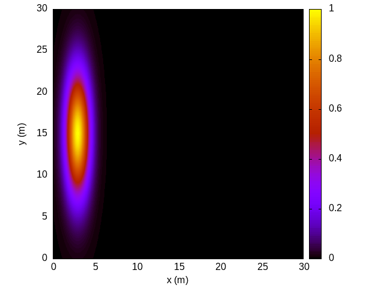
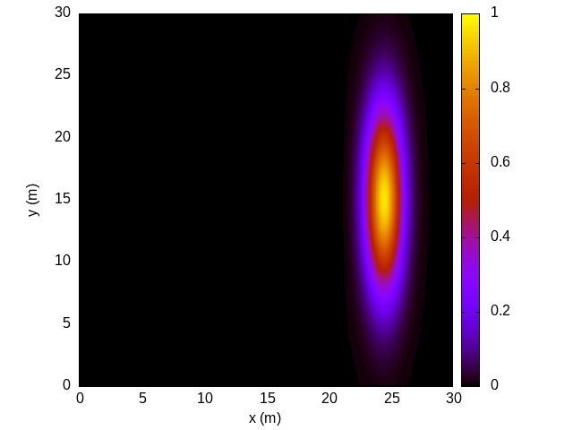
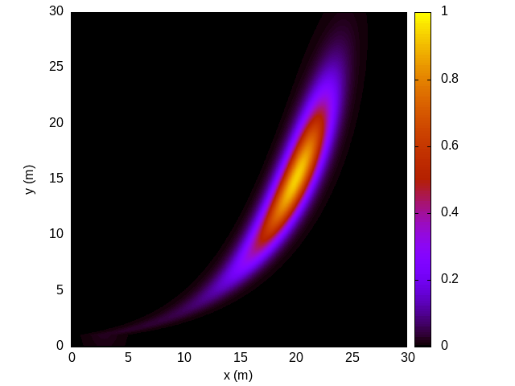
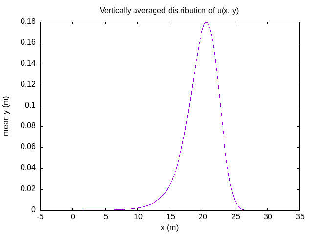

# Material Advection Simulation

 

> Development has ended

This code was part of the continuous assessment for the High Performance Computing module taught by Prof. Luo Man. This code builds upon a C program by parallelising it using OpenMP, modifying parameters and for the final sections I add a logarithmic velocity profile and calculate the vertical average of the horizontal profile of the advected material. At each stage graphical results were made as displayed below and also available in the directory `results`. The exact tasks are available to read in the `specification.pdf` file.

|  |  |
|--------------------------------|--------------------------------|
| |  |

## License

[MIT](https://choosealicense.com/licenses/mit/)
